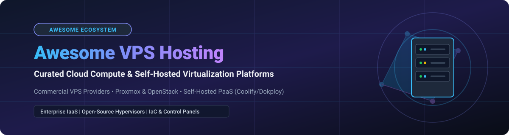

  

# 🚀 Awesome Virtual Private Server (VPS) Hosting Ecosystem

  
  
  
  
  

## 🌐 Top Virtual Private Server (VPS) & Cloud Compute Ecosystem

**A Curated List of Commercial SaaS VPS Providers & Open-Source Infrastructure Projects**  
*Focused on Cloud Compute Instances, Self-Hosted Virtualization, Control Panels, and Infrastructure as Code (IaC)*  

**Last updated: October 2026**

---

Welcome to the definitive guide on **Virtual Private Server (VPS) hosting**, cloud compute instances, and open-source virtualization platforms. Whether you are migrating from shared web hosting to isolated Linux cloud VMs, searching for cost-effective Amazon Lightsail or DigitalOcean alternatives, setting up self-hosted Proxmox VE hypervisors, or deploying open-source PaaS engines like Coolify and Dokploy, this repository tracks category leaders across commercial cloud infrastructure and open-source DevOps tooling.

---

## 📌 Table of Contents

- [📊 Market Insights](#-market-insights)
- [☁️ SaaS / Commercial Hosted VPS Platforms](#️-saas--commercial-hosted-vps-platforms)
- [🔓 Open-Source GitHub Projects](#-open-source-github-projects)
  - [🖥️ Hypervisors & Virtualization Platforms](#️-hypervisors--virtualization-platforms)
  - [🚀 VPS Management & Self-Hosted PaaS](#-vps-management--self-hosted-paas)
  - [⚙️ Control Panels & Web Admin Tools](#️-control-panels--web-admin-tools)
  - [🏗️ Infrastructure as Code & Automation](#️-infrastructure-as-code--automation)
- [🛠️ How to Contribute](#️-how-to-contribute)
- [⚠️ Disclaimer & Architecture Best Practices](#️-disclaimer--architecture-best-practices)
- [📈 Star History](#-star-history)
- [❤️ Support & Sponsorship](#️-support--sponsorship)

---

## 📊 Market Insights

> **Market Overview**: The global Virtual Private Server (VPS) market is projected to grow from **$6.2 Billion (2026)** to **$19+ Billion by 2030** at a CAGR of **~16.2%**. The sector is **moderately fragmented** — dominated at the top by enterprise cloud hyperscalers (AWS, Azure, GCP), while maintaining a vibrant, competitive mid-market of specialized developer-focused cloud providers (DigitalOcean, Vultr, Hetzner, Linode) and rapid open-source self-hosting innovation.

---

## ☁️ SaaS / Commercial Hosted VPS Platforms

*Commercial VPS providers offering globally managed compute instances, automated backups, DDoS mitigation, and guaranteed uptime SLAs. Sorted by estimated company valuation / market cap (descending).*

| Platform | Description | Starting Price | Free Tier / Free Trial Limit | Company Scale / Valuation / Revenue |
| :--- | :--- | :--- | :--- | :--- |
| **[Amazon Lightsail](https://aws.amazon.com/lightsail/)** ☁️ | AWS's simplified VPS offering with predictable flat monthly pricing, pre-configured blueprints, and seamless AWS ecosystem integration. | $3.50/month | 3 months free (750 hours/month on select Linux/Windows bundles) | **~$1.8+ Trillion** (AWS Parent Market Cap) |
| **[Linode by Akamai](https://www.linode.com/)** 🌐 | Reliable independent VPS pioneer with developer-focused infrastructure, now backed by Akamai's global edge network. | $5.00/month | $100 free credit valid for 60 days | **~$14.5 Billion** (Akamai Parent Market Cap) |
| **[OVHcloud VPS](https://www.ovhcloud.com/en/vps/)** 🛡️ | European VPS leader providing high anti-DDoS protection, customizable resources, and GDPR-compliant data sovereignty. | $4.20/month | No free trial (30-day money-back guarantee) | **~$1.6 Billion** (Public Market Cap / ~$1B Annual Rev) |
| **[DigitalOcean Droplets](https://www.digitalocean.com/products/droplets)** 🌊 | The developer-friendly VPS standard featuring simple pricing, extensive documentation, and a rich developer community. | $4.00/month | $200 free credit valid for 60 days | **~$3.2 Billion** (Public Market Cap / ~$700M+ ARR) |
| **[Scaleway Elements](https://www.scaleway.com/en/virtual-instances/)** ⚡ | French cloud provider offering flexible virtual instances, bare metal servers, and high data sovereignty. | €4.99/month | No free trial (€100 free credit available for Business accounts) | **~$1.0+ Billion** (Iliad Group Subsidiary) |
| **[Vultr Cloud Compute](https://www.vultr.com/)** 🚀 | High-performance cloud compute instances deployed across 30+ global data center locations with bare metal options. | $2.50/month | $250 free credit valid for 30 days | **~$1.0+ Billion** (Private Unicorn / Constant Scale) |
| **[Hetzner Cloud](https://www.hetzner.com/cloud)** 🇩🇪 | European cloud instances offering industry-leading price-to-performance ratio and fast NVMe storage options. | €3.79/month | No free trial (30-day money-back guarantee / pay-as-you-go) | **~$400M+** (Private Annual Revenue) |
| **[Hostinger Cloud](https://www.hostinger.com/vps-hosting)** 💼 | Budget-friendly VPS hosting with managed support options, AI assistant tools, and easy control panel setup. | $4.99/month | 30-day money-back guarantee | **~$150M+** (Private Annual Revenue) |
| **[DreamHost VPS](https://www.dreamhost.com/hosting/vps/)** 🐘 | Managed Linux VPS hosting featuring unmetered bandwidth, pre-configured environment, and 24/7 expert web support. | $10.00/month | 30-day money-back guarantee | **~$70M+** (Private Annual Revenue) |
| **[Kamatera](https://www.kamatera.com/)** ⚙️ | Highly customizable cloud server instances with instant resource scaling and global cloud datacenters. | $4.00/month | 30-day free trial (up to $100 credit) | **~$50M+** (Private Enterprise Hosting) |

---

## 🔓 Open-Source GitHub Projects

*Open-source projects for building, provisioning, and managing VPS infrastructure. Sorted by GitHub Stars_Count (descending) within each category.*

### 🖥️ Hypervisors & Virtualization Platforms

| Repository | GitHub_Stars | License | Description |
| :--- | :--- | :--- | :--- |
| **[OpenStack](https://github.com/openstack)** ☁️ |  | Apache-2.0 | **The leading open-source cloud infrastructure IaaS platform**. Powers public and enterprise private clouds (Compute Nova, Storage Cinder/Swift, Networking Neutron). |
| **[Proxmox VE](https://github.com/proxmox/pve-manager)** 🖥️ |  | AGPL-3.0 | **De facto open-source VMware alternative**. Enterprise Debian-based virtualization management platform with KVM hypervisor, LXC containers, web GUI, clustering, and HA. |
| **[Apache CloudStack](https://github.com/apache/cloudstack)** ⚡ |  | Apache-2.0 | Multi-hypervisor turn-key IaaS platform supporting KVM, XenServer, and VMware for enterprise VPS provisioning. |
| **[Harvester](https://github.com/harvester/harvester)** 🌾 |  | Apache-2.0 | Open-source hyperconverged infrastructure (HCI) built on Kubernetes and KVM by SUSE / Rancher. |
| **[OpenNebula](https://github.com/OpenNebula/one)** 🌌 |  | Apache-2.0 | Simple and agile open-source cloud management platform for multi-cloud, edge computing, and virtualized workloads. |
| **[Incus](https://github.com/lxc/incus)** 📦 |  | Apache-2.0 | Community-driven fork of LXD offering powerful container and virtual machine management daemon. |
| **[XCP-ng](https://github.com/xcp-ng/xcp)** 🛡️ |  | GPL-2.0 | Enterprise-grade Xen-based hypervisor derived from XenServer with Xen Orchestra web control panel. |
| **[oVirt](https://github.com/oVirt/ovirt-engine)** 🔧 |  | Apache-2.0 | KVM-based open-source virtualization engine, successor to Red Hat Enterprise Virtualization. |

### 🚀 VPS Management & Self-Hosted PaaS

| Repository | GitHub_Stars | License | Description |
| :--- | :--- | :--- | :--- |
| **[Coolify](https://github.com/coollabsio/coolify)** 💎 |  | Apache-2.0 | **#1 open-source self-hosted PaaS**. Turns any bare VPS into a Heroku / Vercel alternative with Git deployments, automatic SSL, preview environments, and databases. |
| **[Dokku](https://github.com/dokku/dokku)** 🐳 |  | MIT | **Docker-powered mini-Heroku**. Lightweight bash PaaS allowing simple `git push dokku main` deployment on any cloud virtual machine. |
| **[Dokploy](https://github.com/Dokploy/dokploy)** 🚀 |  | Apache-2.0 | Modern open-source deployment engine with a sleek UI for managing applications, databases, and Docker workloads on VPS. |
| **[CapRover](https://github.com/caprover/caprover)** ⛵ |  | Apache-2.0 | Extremely easy-to-use PaaS & web GUI for deploying applications and 100+ one-click preconfigured services on VPS. |
| **[Kamal](https://github.com/basecamp/kamal)** 🧱 |  | MIT | Zero-downtime container deployment engine from Basecamp. Deploys web apps from local machine straight to raw cloud VMs over SSH. |
| **[YunoHost](https://github.com/YunoHost/yunohost)** 🐧 |  | AGPL-3.0 | Debian-based self-hosting operating system designed to automate web services, email, and user management for non-techies on VPS. |

### ⚙️ Control Panels & Web Admin Tools

| Repository | GitHub_Stars | License | Description |
| :--- | :--- | :--- | :--- |
| **[Webmin](https://github.com/webmin/webmin)** 📜 |  | BSD-3-Clause | Veteran web-based system administration panel for Unix/Linux servers to configure user accounts, Apache, DNS, and file sharing. |
| **[HestiaCP](https://github.com/hestiacp/hestiacp)** 🏆 |  | GPL-3.0 | Lightweight and fast open-source web hosting control panel for Linux with Nginx/Apache support, mail server, and DNS management. |
| **[CloudPanel](https://github.com/cloudpanel-io/cloudpanel-ce)** ⚡ |  | GPL-3.0 | High-performance PHP/NodeJS/Python server management control panel optimized for speed with Nginx and MySQL. |
| **[CyberPanel](https://github.com/usmannasir/cyberpanel)** ⚡ |  | GPL-3.0 | Open-source web hosting control panel powered by LiteSpeed / OpenLiteSpeed with built-in LSCache for WordPress. |
| **[Ajenti](https://github.com/ajenti/ajenti)** 🎛️ |  | MIT | Modular responsive web administrative dashboard for Linux server setup, monitoring, and command execution. |
| **[Virtualmin](https://github.com/virtualmin/virtualmin-gpl)** 🖥️ |  | GPL-3.0 | Powerful domain hosting and virtual server management panel integrated into Webmin. |

### 🏗️ Infrastructure as Code & Automation

| Repository | GitHub_Stars | License | Description |
| :--- | :--- | :--- | :--- |
| **[Ansible](https://github.com/ansible/ansible)** 🤖 |  | GPL-3.0 | Agentless configuration management, application deployment, and task automation platform for provisioning cloud VPS. |
| **[Terraform](https://github.com/hashicorp/terraform)** 🏗️ |  | BSL-1.1 | De facto Infrastructure as Code (IaC) tool for declarative cloud resource provisioning across AWS, DO, Linode, Vultr, and Hetzner. |
| **[Pulumi](https://github.com/pulumi/pulumi)** 💻 |  | Apache-2.0 | Infrastructure as Code using real programming languages (TypeScript, Python, Go, C#) instead of YAML/HCL. |
| **[OpenTofu](https://github.com/opentofu/opentofu)** 🍞 |  | MPL-2.0 | Community-driven, open-source fork of Terraform managed under Linux Foundation with full backward compatibility. |
| **[cloud-init](https://github.com/canonical/cloud-init)** ⚙️ |  | Apache-2.0 | Industry standard multi-distribution package for early initialization and bootstrap customization of cloud instances. |

---

## 🛠️ How to Contribute

Contributions are warmly welcomed! Please follow these guidelines:

1. **Fork** the repository: [https://github.com/ishandutta2007/Awesome-Awesome-Awesome](https://github.com/ishandutta2007/Awesome-Awesome-Awesome).
2. Create a new topic branch for your entry.
3. Keep descriptions factual, concise, and neutral.
4. Open a Pull Request with details regarding why the tool or provider should be included.

---

## ⚠️ Disclaimer & Architecture Best Practices

- **Community Curated**: This list is community-curated for educational and architectural decision-making purposes.
- **Shared vs. Dedicated Infrastructure**: Commercial SaaS providers (DigitalOcean, Lightsail, Linode) manage hypervisor patches, hardware faults, and routing SLAs. Self-hosted virtualization (Proxmox VE, OpenStack) gives full data sovereignty but transfers hardware maintenance, backups, and security patching to you.
- **PaaS on VPS**: Self-hosted PaaS solutions (Coolify, Dokploy) greatly simplify application deployments, but server kernel maintenance, firewalls, and database storage persistence remain operator responsibilities.

---

## 📈 Star History

---

## ❤️ Support & Sponsorship

If you found this curated VPS resource useful, please consider starring ⭐, sharing 📢, or supporting the project!

- **Star the repo**: Click the ⭐ icon at the top right of this page.
- **Fork & Contribute**: Help keep pricing, open-source projects, and links updated.
- **Sponsor the Maintainer**: Support ongoing open-source maintenance via [GitHub Sponsors](https://github.com/sponsors/ishandutta2007).

